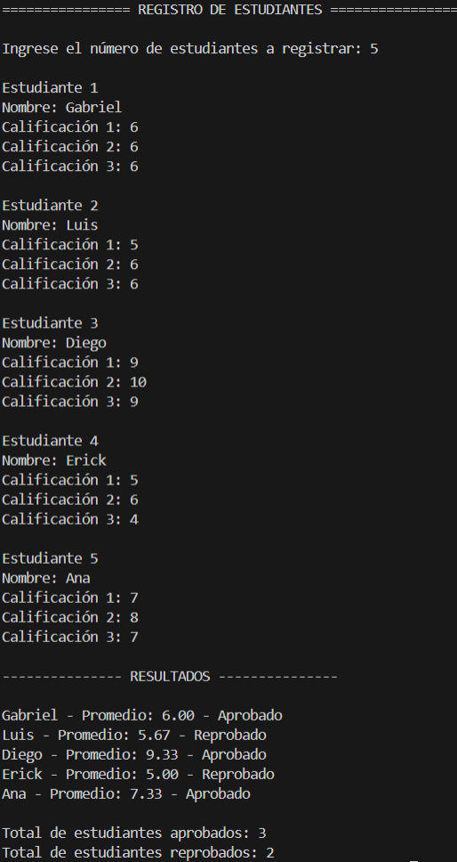
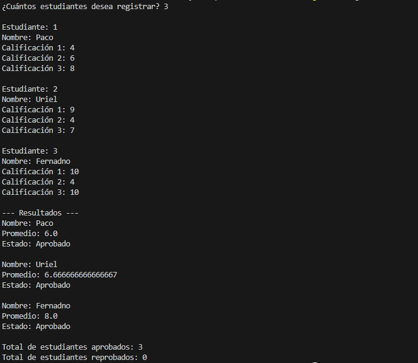

# Registro y Evaluación de Estudiantes
## Objetivo del Proyecto

El propósito del proyecto es desarrollar una aplicación de consola que permita registrar estudiantes, almacenar sus calificaciones, calcular su promedio y determinar si han aprobado o reprobado. Este proyecto busca:

	•	Practicar estructuras de control (for, if, while)
 
	•	Utilizar funciones o clases para separar la lógica del programa
 
	•	Aplicar listas (Python) o ArrayList (Java)
 
	•	Comprender la conversión de un programa procedural a uno orientado a objetos

## Versión en Python
## Funciones Utilizadas

calcular_promedio(): Calcula el promedio de 3 calificaciones

evaluar_aprobacion(): Devuelve True si el promedio es ≥ 6.0, en otro caso devuelve False

## Instrucciones para Ejecutar

1. Guardar el archivo como registro_studiantes.py
2. Ejecutar en consola con: python registro_estudiantes.py

## Lógica Principal

- Solicita el número de estudiantes a registrar
- Para cada estudiante:
   - Pide el nombre y 3 calificaciones
   - Calcula el promedio
   - Evalúa si aprobó o reprobó
- Al final muestra:
   - Nombre, promedio, estado (Aprobado/Reprobado)
   - Conteo total de aprobados y reprobados

  ## Versión en Java
  ## Clases Utilizadas
  
  Main: Controla el flujo principal del programa (entrada de datos, resultados)

Estudiante: Define los atributos nombre, calificaciones, promedio y estado

## Instrucciones para Compilar
1. Asegúrate de tener los siguientes archivos en el mismo paquete (carpeta):
   practicaTraducidoJava/
  ├── Estudiante.java
  └── Main.java
2. Compila ambos archivos desde la terminal: javac practicaTraducidoJava/*.java
3. Ejecuta el programa: java practicaTraducidoJava.Main

   ## Lógica Principal
   - Se usa Scanner para capturar entradas
   - Se crea una lista de objetos Estudiante
   - Cada estudiante se construye con:
      - Nombre
      - Lista de 3 calificaciones
   - En el constructor de Estudiante, se calculan:
      -  Promedio automáticamente
      -  Estado (Aprobado/Reprobado)
   -  Finalmente, se imprime el resumen con totales
  
     ## Conclusiones
   	•	La versión en Python es más compacta y directa, ideal para scripts simples.
	•	La versión en Java usa Programación Orientada a Objetos, lo que permite mayor escalabilidad y organización.
	•	Ambos programas refuerzan buenas prácticas como separación de lógica y validación por funciones/métodos.
	•	El uso de listas (list, ArrayList) facilita el almacenamiento dinámico de datos.

### Capturas
 
 
